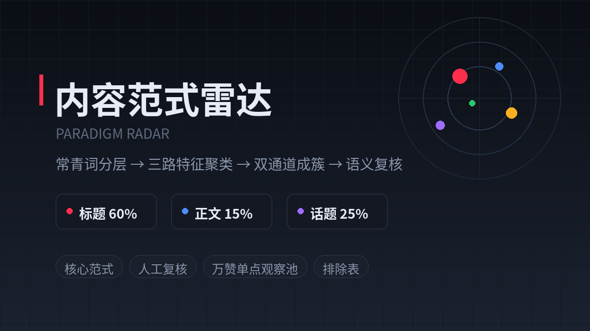

# 灵感星图雷达 Inspiration Paradigm Radar

> 黑客松项目 —— 把一堆爆款笔记,变成一张能抄作业的「爆款套路地图」。



## 这是什么?

一句话:**输入一份笔记数据 CSV,自动聚出几类可复制的爆款套路,再用一张星图帮你把套路和自己的灵感连起来。**

给做内容的人用(小红书、公众号、短视频都行)。你肯定遇到过这些问题:

- 收藏了 500 篇爆款笔记,却说不出它们到底火在哪;
- 想跟风选题,不知道哪些套路是「多人验证过、还能再跟」的,哪些只是偶发爆款;
- 灵感散落在备忘录里,和爆款之间对不上号。

本项目把这些一次性解决:导入 CSV → 引擎自动聚类 → 得到「核心范式 / 待复核 / 单点爆款 / 干扰项」四个分区 → 在星图里把范式和自己的灵感连线,辅助选题判断。

## 两个核心页面

**范式雷达** —— 分析主战场。把导入的笔记按「标题 / 正文 / 话题」三路特征聚类,相似套路的笔记归为一簇,并按可复制性分成四区:

| 分区 | 含义 | 建议动作 |
|---|---|---|
| 核心范式 | 跨作者成立、可大规模复制的套路 | 优先跟发 |
| 待复核簇 | 边界模糊,机器拿不准 | 人工过一眼 |
| 万赞单点 | 高互动但孤立的早期信号 | 放观察池,别急着跟 |
| 排除表 | 平台活动 / 纯教程 / 广告等非范式内容 | 保留供复盘 |

**灵感星图** —— 把上面的结果画成一片星空:核心范式是恒星,待复核是星胚,单点爆款是伴星,你自己的灵感可以手动拖进去变成灵感星;「同选题 / 同情绪 / 同表达机制」的内容自动连成星座。哪片星座亮,哪里的选题机会就密。

## 快速开始

不需要数据库、不需要 AI 配置,clone 下来 3 条命令就能跑,自带 Demo 数据:

```bash
git clone https://github.com/yeluowan/inspiration-paradigm-radar.git
cd inspiration-paradigm-radar
pip install -r requirements.txt
uvicorn app:app --port 3000
```

打开 `http://localhost:3000` 即可。默认进入灵感星图,点导航切换范式雷达;直接点「加载 Demo」体验完整流程,或导入自己的 CSV。

只想看效果不想装环境?打开 [`public-showcase/index.html`](public-showcase/index.html) 即可,这是零后端、零登录的纯静态演示页,也可以直接部署到 GitHub Pages。

## CSV 字段

分析至少需要可映射为以下字段的数据:

| 字段 | 含义 |
|---|---|
| `title` | 标题(必填) |
| `body` | 正文(可空) |
| `topics` | 话题,多个用逗号分隔 |
| `likes` | 点赞数 |
| `views` | 浏览量(可空) |
| `author` | 作者标识(可空) |
| `url` | 样本链接(可空) |

## 可选配置(不配也不影响核心功能)

| 配置 | 作用 |
|---|---|
| `db.properties`(从 `.example` 复制) | 连 PostgreSQL,保存数据集与每日快照,追踪范式随时间的演进 |
| `ai.properties`(从 `.example` 复制) | 接 OpenAI 兼容网关生成扩展报告;不配置时自动降级为规则化报告 |
| 环境变量 `REQUIRE_SSO=true` | 内网部署时启用 SSO Header 校验;本地默认匿名 Demo 用户 |

## 实现上的几个取舍

- **零机器学习依赖**:聚类引擎纯 Python 实现(无 sklearn / jieba),中文用字符 bi-gram 做特征,避免机械分词;标题 / 正文 / 话题按 60 / 15 / 25 加权。
- **常青词降权而非删除**:「摄影」「攻略」这类永远出现的词只降权,白名单词(如「特种兵」「反向旅游」)保留全权重。
- **可解释优先**:每个簇保留代表样本、聚类依据与互动指标,留人工复核入口,不给黑盒结论。

技术栈:FastAPI · PostgreSQL(可选)· 原生 HTML/CSS/JavaScript

## 隐私与数据

请只导入你拥有处理权限的数据。仓库不包含业务数据、访问令牌、内部服务地址或任何用户隐私数据。

## License

[MIT](LICENSE)
